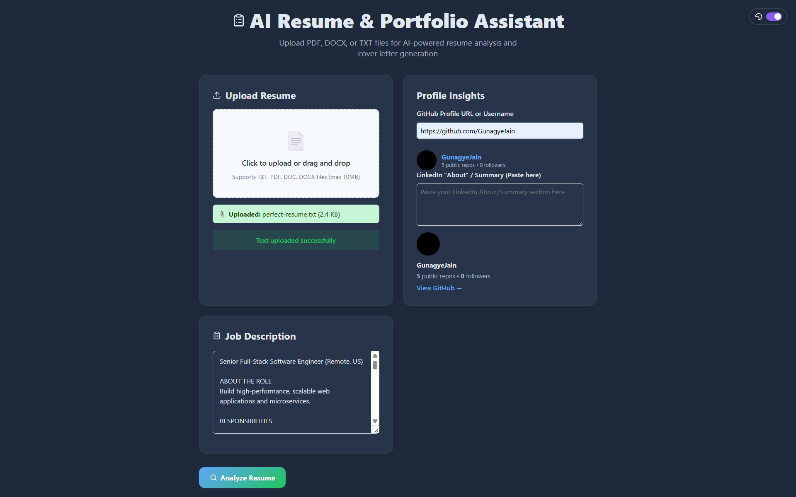
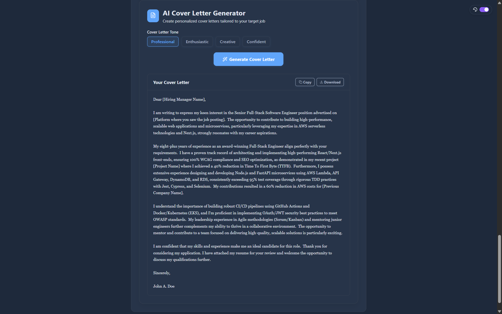
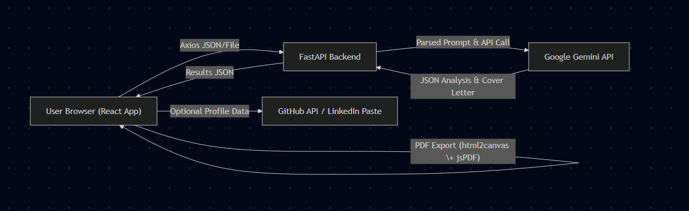

# AI Resume & Portfolio Assistant

## 📌 Overview
An AI-powered web application for resume analysis, ATS-score estimation, and cover letter generation using Google’s Gemini API. Provides structured feedback, personalized recommendations, and PDF export in a light/dark-themed interface.

## ✨ Features
- Upload resume (PDF, DOCX, TXT) or paste text  
- Enter job description for tailored AI analysis  
- AI-generated structured feedback & recommendations  
- Overall rating (0–10) and ATS compatibility score (0–100)  
- Cover letter generation with tone options  
- PDF export of analysis, cover letter, or both  
- Dark/Light mode toggle  
- Optional GitHub & LinkedIn profile insights  

---

## 🛠 Tech Stack
- **Frontend:** React, TypeScript, Framer Motion, Lucide Icons, html2canvas, jsPDF  
- **Backend:** FastAPI (Python), Pydantic, httpx, Uvicorn  
- **AI Model:** Google Gemini 1.5 Flash REST API  
- **Styling:** CSS variables, responsive grid & flexbox  

---

## 📂 Project Structure
root
├── frontend/ # React app
│ ├── src/
│ │ ├── components/ # UI components (FileUpload, Analysis, CoverLetter, ThemeToggle, etc.)
│ │ ├── hooks/ # Custom hooks (useGitHubProfile)
│ │ ├── contexts/ # ThemeContext
│ │ ├── App.tsx # Main UI layout & logic
│ │ └── App.css # Styles & theme variables
│ └── package.json
├── backend/ # FastAPI app
│ ├── simple_main.py # API endpoints, CORS, Gemini integration
│ └── requirements.txt # Python dependencies
└── README.md # Project overview & setup


---

## ⚙️ Setup Instructions

### 1. Clone repository  
```git clone https://github.com/GunagyeJain/resume-assistant-ai.git```

```cd ai-resume-assistant```


### 2. Backend setup  
```cd backend```

```python3 -m venv venv```

```source venv/bin/activate```

```pip install -r requirements.txt```


Create a `.env` file in `backend/`:
GEMINI_API_KEY=your_google_gemini_api_key


Run FastAPI server:

```uvicorn simple_main:app --reload --port 8000```


### 3. Frontend setup  
`cd ../frontend`

`npm install`

`npm start`


Open your browser at [**http://localhost:3000**](http://localhost:3000).

---

## 🌐 Environment Variables

- **Backend**  
  - `GEMINI_API_KEY` → Google Gemini API key  
- **Frontend**  
  - Edit API base URL in `src/App.tsx` if needed (default: `http://localhost:8000`)

---

## 🚀 Usage Guide

1. Launch backend (`localhost:8000`) and frontend (`localhost:3000`).  
2. **Upload Resume**: PDF/DOCX/TXT or paste text.  
3. **Enter Job Description** in the adjacent card.  
4. Click **Analyze Resume**.  
5. Review AI feedback: overall rating, ATS score, skills match, strengths, weaknesses, recommendations.  
6. Generate a personalized cover letter.  
7. Export analysis, cover letter, or full report as PDF.  
8. Toggle between light and dark modes via the button in the top right.

---

## 🔗 API Endpoints

### `GET /health`  
**Response:**  
`{ "status": "ok" }`

### `POST /resume/analyze`  
**Request JSON:**  
`{`

`"text": "Resume text here...",`

`"job_description": "Job description here...",`

`"github_profile": { /* optional profile data */ },`

`"linkedin_summary": "Optional LinkedIn summary text"`

`}`
**Response JSON:**  


`{`

`"analysis": {`

`"overall_rating": "8/10",`

`"ats_score": "85/100",`

`"skills_match": ["JavaScript", "React"],`

`"skills_missing": ["TypeScript", "Node.js"],`

`"strengths": ["Clear formatting", "Relevant projects"],`

`"weaknesses": ["Missing keywords", "No quantifiable metrics"],`

`"recommendations": ["Add bullet metrics", "Include more tech keywords"],`

`"raw": "…" // Raw AI response if parsing failed`

`}`

`}`

### `POST /resume/analyze-file`  
Form-data fields:  
- `file`: Resume file (PDF, DOCX, TXT)  
- `job_description`: (optional) text  
- `github_profile`: (optional) JSON string  
- `linkedin_summary`: (optional) text  

**Response:** Same JSON schema as `/resume/analyze`.

### `POST /cover-letter/generate`  
**Request JSON:**  

`{`
`"resume_text": "Text of resume or summary...",`
`"job_description": "Job description text",`
`"tone": "professional"`
`}`

**Response JSON:**  

`{ "cover_letter": "Dear Hiring Manager, …" }`


---

## 📸 Screenshots

  

  

---

## 🗺 Architecture Diagram

  

---

## 📜 License
This project is licensed under the MIT License. See `LICENSE` for details.

---

## 🚀 Future Improvements
- Real-time GitHub & LinkedIn scraping for dynamic insights  
- User authentication & profile management  
- Enhanced NLP scoring algorithms  
- Multilingual support  
- Hosted production deployment with Docker & CI/CD  

---

*Prepared by HackClub, [10/08/25]*  
*Team Members - Gunagye Jain, Akshit Mishra*
